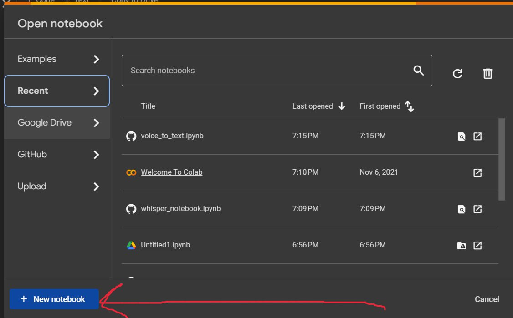
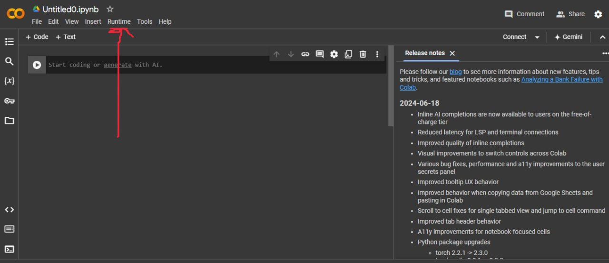
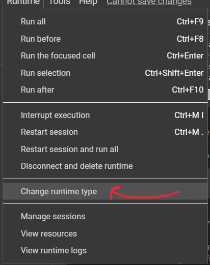
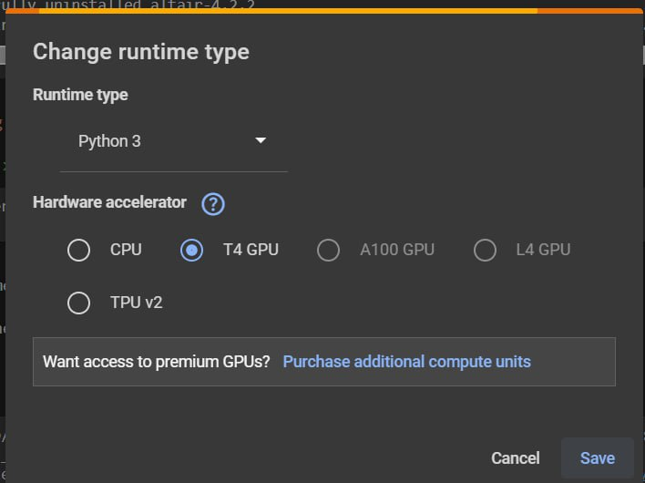
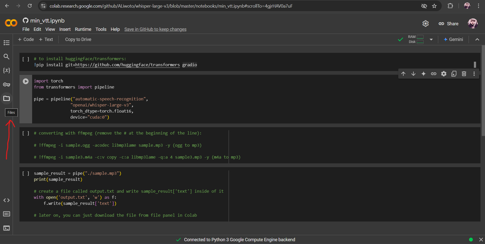
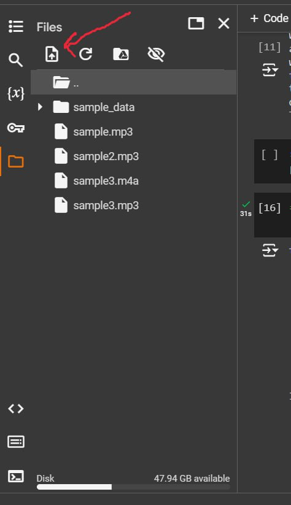
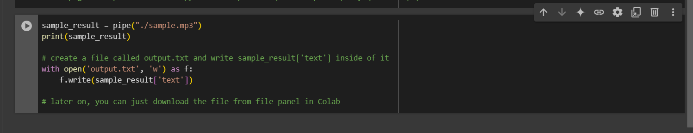
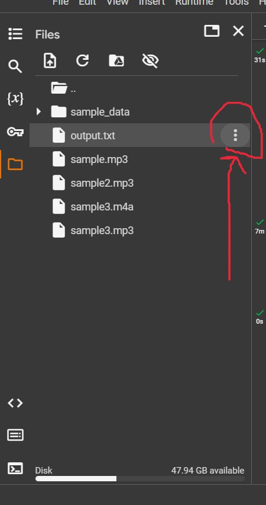

# How to run the model on Google Colab

This is a step-by-step, beginner-friendly guide on how to run the model on Google Colab.
No previous knowledge of Google Colab is required.

## Step1

Go to this website: <https://colab.research.google.com/>

## Step2

Click on "new notebook"

## Step3.1

Click on "Runtime"

## Step3.2

Click on "Change runtime type"

## Step3.3

Python3
T4 GPU

and then click save and whatever website tells you, press Ok.

## Opening a file from GitHub

To open a Jupiter notebook from GitHub, you can format a URL such as this:
<https://colab.research.google.com/github/ALiwoto/whisper-large-v3/blob/master/notebooks/voice_to_text.ipynb>

## Running the model

To run the model, you can simply run the cells one by one by pressing the play button on the left side of each cell.

Please do NOTE: the order is very important. You should run the cells in the order they are in the notebook.

## File uploads

You can upload files to Google Colab by clicking on the file icon on the left side of the screen.

Then inside of the shown panel, you can click on the "Upload" button to upload your files.

To rename your file, you can click on the "three dots" icon and then click on "Rename".

## Access file from scripts

You can access the files you uploaded such as this.

## Download output file

You can download the output file by clicking on the file icon on the left side of the screen.
Then clicking on the "three dots" icon and then clicking on "Download".
